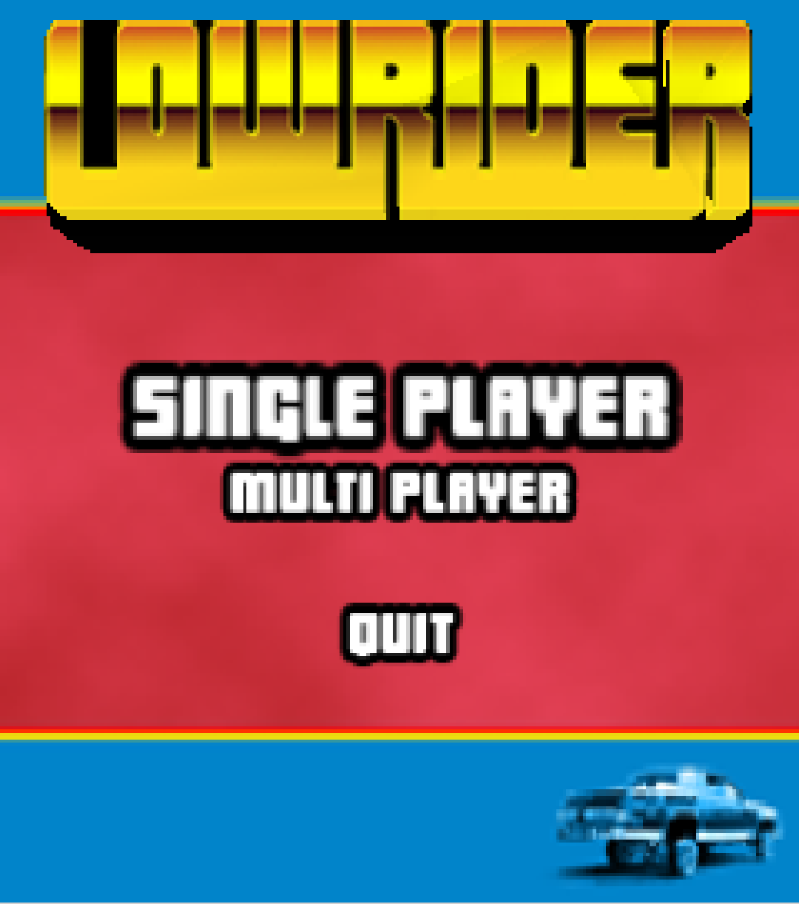
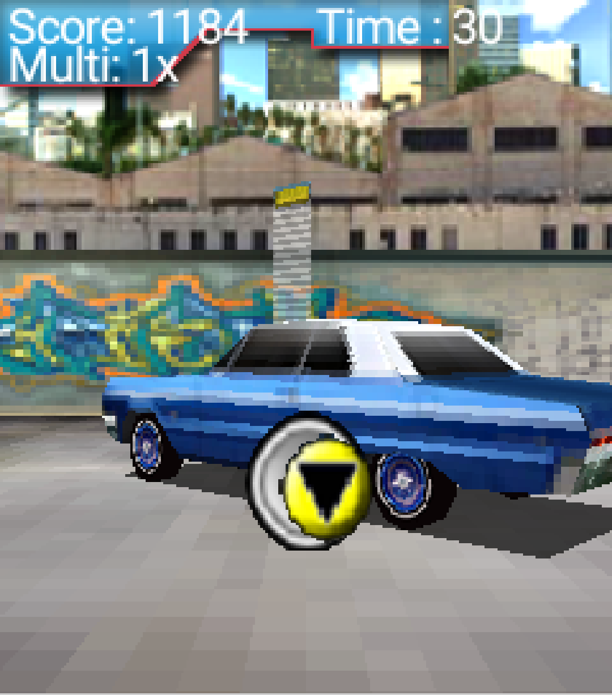

# Lowrider

(c) 2005 Magnus Borg, Erik Zivkovic

## Project Report

[Lowrider Mobile Game Report EDA075 Mobile Computer Graphics](./release/Project_Lowrider.pdf)

## Winners of course competition

This game won the EDA075 2005 class competition, [mentioned in this PDF](./release/EDA075-winners.pdf) from the course the year after

## How to run

The .jar file in the release folder can still be run in a J2ME emulator!
